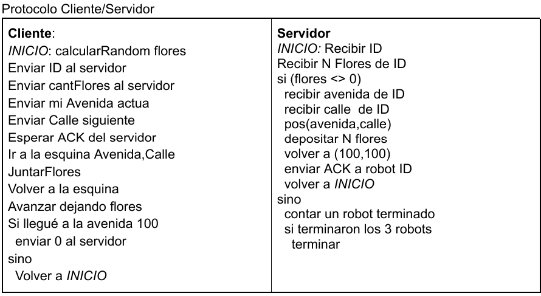

<h1 align="center">Concurrente Parte 1.</h1>

### Objetivo:
_**Realizar programas en R-info en los que múltiples robots realizan tareas. Diseñar soluciones con
robots del mismo tipo y con robots de diferentes tipos. Analizar situaciones de posibles colisiones.**_

1. Realice un programa para que un robot junte todas las flores de la avenida 1 y las deposite al final
de dicha avenida. Al finalizar, debe informar la cantidad de flores depositadas y la cantidad de
esquinas sin flores que encontró durante el recorrido.  
   1. Modifique el programa anterior para que el mismo robot realice lo mismo en las avenidas 1, 3
y 5.

   2.  Modifique el programa anterior para que el trabajo sea realizado por 3 robots: uno realiza la
avenida 1, otro realiza la avenida 3 y otro la avenida 5. Cada robot debe iniciar en las esquina
(1,1), (3,1) y (5,1) respectivamente.
    - [Resolución ejercicio 1](./Parte1/P1Ejercicio_01.txt)
  
2. Realice un programa en el que 4 robots limpien de papeles el perímetro de un cuadrado de lado 20 en sentido horario.  
El vértice inferior izquierdo del cuadrado se ubica en la esquina (10,10).  
Al finalizar, cada robot debe informar la cantidad de papeles juntados en su lado.  
Al realizar este programa, analizar:  

   1. ¿Cómo deben declararse la o las áreas?

   2. ¿Existe riesgo de colisión?

   - [Resolución ejercicio 2](./Parte1/P1Ejercicio_02.txt)

  
3. Realice un programa en el que 3 robots realicen escaleras de 4 escalones. El tamaño de cada
escalón se incrementa en un 1 respecto al escalón anterior. El primer escalón será de 1x1, el
segundo de 2x2, y así sucesivamente.  
Al finalizar el recorrido, cada robot debe informar la cantidad de escalones en los que la
cantidad de papeles superó en 1 a la cantidad de flores. Las esquinas deben quedar sin
modificar.
    - [Resolución ejercicio 3](./Parte1/P1Ejercicio_03.txt)
  
4. Realice un programa en el que dos robots se encargan de limpiar las ciudad. La ciudad se dividió
en 4 áreas: las impares (1 y 3) deben limpiarse de flores; y las pares (2 y 4) deben limpiarse de
papeles. Un robot debe encargarse de las áreas impares y otro robot de las pares. Modularice el
recorrido de cada área.
    - Área 1: desde la avenida 1 hasta la avenida 25.
    - Área 2: desde la avenida 26 hasta la avenida 50.
    - Área 3: desde la avenida 51 hasta la avenida 75.
    - Área 4: desde la avenida 76 hasta la avenida 100.  
    
    **a.** Analizar (no es necesario implementar) qué se debería modificar si ahora se pide que la
    ciudad se divida en 20 áreas:
   - Área 1: Avenidas 1 a 5.
   - Área 2: Avenidas 6 a 10.
   - …
   - Área 19: Avenidas 91 a 95.
   - Área 20: Avenidas 96 a 100.
   - [Resolución ejercicio 4](./Parte1/P1Ejercicio_04.txt)  

5. Realice un programa en el que cuatro robots realizan las siguientes actividades:
    - El robot 1 debe limpiar de flores las primeras 15 esquinas de las calles 75 y 80. Al finalizar
cada calle, debe depositar todas las flores en la última esquina.
    - El robot 2 debe limpiar de papeles las últimas 20 esquinas de las avenidas 75 y 80. Al
finalizar cada avenida debe depositar todos los papeles en la primera esquina.
    - El robot 3 debe limpiar de flores las últimas 30 esquinas de las calles 10 y 15. Al finalizar
cada calle, debe depositar todas las flores en la última esquina.
    - El robot 4 debe limpiar de papeles las primeras 10 esquinas de las avenidas 10 y 15. Al
finalizar cada avenida debe depositar todos los papeles en la primera esquina.
    - [Resolución ejercicio 5](./Parte1/P1Ejercicio_05.txt)

<h1 align="center">Concurrente Parte 2.</h1>

### Objetivo:
_**Realizar programas en R-info con distintos tipos de robots. Utilizar el pasaje de mensajes para
la comunicación entre robots. Usar la función random para generar valores aleatorios..**_

1. Dos robots compiten para ver cuál junta más flores. El primer robot recoge todas las
flores de la avenida 1 entre las calles 1 y 10. El segundo robot recoge todas las flores
de la avenida 2, entre las calles 11 y 20.  
Al finalizar el recorrido, el robot que recogió mayor cantidad de flores debe informar la
diferencia de flores que obtuvo respecto al robot perdedor (el que obtuvo menos flores).  
Los robots inician en las esquinas (1, 1) y (2, 11) respectivamente.  
   **b.** Modifique el ejercicio anterior, considerando que ahora habrá un robot fiscalizador,
que será responsable de informar la diferencia de flores que obtuvo el ganador con
respecto al perdedor. El robot fiscalizador se ubica en la esquina (2,1).  
   **c.** Modifique el ejercicio anterior para que ahora participen 6 robots. El fiscalizador deberá informar la cantidad de flores que juntó el robot ganador.
      - Robot 1: Avenida 1, entre las calles 1 y 10
      - Robot 2: Avenida 2, entre las calles 11 y 20
      - Robot 3: Avenida 3, entre las calles 21 y 30
      - Robot 4: Avenida 4, entre las calles 31 y 40
      - Robot 5: Avenida 5, entre las calles 41 y 50
      - Robot 6: Avenida 6, entre las calles 51 y 60
      - Fiscalizador: Avenida 2, calle 1

   **d.** Modifique el inciso anterior para que ahora el fiscalizador informe también, cuál fue el
robot ganador.

   - [Resolución ejercicio 1](./Parte2/P2Ejercicio_01.txt)

2. Realice un programa en el que 3 robots realizan una escalera de 4 escalones cada uno.
Todos los escalones tienen un ancho fijo de 1, y un alto aleatorio entre 1 y 5. Al finalizar
el recorrido, cada robot deberá enviar al robot jefe la cantidad de escalones que tenían
más flores que papeles. Una vez que los tres robots finalizaron, el robot jefe deberá
informar la suma de las cantidades enviadas por los 3 robots.
   - El robot jefe inicia en la esquina (1,1)
   - El robot 1 inicia en la esquina (2,1)
   - El robot 2 inicia en la esquina (7,1)
   - El robot 3 inicia en la esquina (12,1)
   - [Resolución ejercicio 2](./Parte2/P2Ejercicio_02.txt)

3. Realice un programa con 2 equipos: Los robots A1 y B1 deberán realizar las 10 primeras esquinas de su recorrido, y al
finalizar avisarán a los robots A2 y B2 respectivamente para que continúen con las
siguientes 10 esquinas. El segundo robot de cada equipo debe informar la cantidad
de elementos recogidos en las 20 esquinas.  
Inicialice los 4 robots en las esquinas que considere más apropiadas según el
trayecto que le corresponde realizar a cada uno.
   - El equipo A, compuesto por los robots A1 y A2, debe juntar papeles de las
primeras 20 esquinas de la calle 1.
   - El equipo B, compuesto por los robots B1 y B2, debe juntar flores de las primeras
20 esquinas de la calle 5. 

   **b.** Modifique el programa anterior para que cada equipo repita el recorrido con las
siguientes 20 esquinas de sus correspondientes calles.  
   **c.** Analice (no es necesario implementar) cómo implementaría el inciso b si ahora cada
equipo debe realizar 8 segmentos de 20 esquinas.  

   - [Resolución ejercicio 3](./Parte2/P2Ejercicio_03.txt)

4. Realice un programa en el que un robot fiscalizador controla el acceso de 4 robots
recolectores al cuadrante encerrado entre las esquinas (25,25) y (75,75) . Para ello, el
robot fiscalizador avisa a un robot recolector aleatorio que puede ingresar al área. El
robot que recibe la autorización de acceso calcula una esquina aleatoria dentro del
área, limpia dicha esquina de flores y papeles, regresa a su esquina y avisa al robot
fiscalizador que ya finalizó.  
Se realizarán en total 10 accesos al cuadrante entre los 4 robots recolectores. Al
finalizar, el robot fiscalizador deberá indicar al robot ganador que se posicione en la
esquina (50,50).  
El robot fiscalizador inicia en la esquina (1,1) y los robots recolectores inician en las
esquinas (25,1) (30,1) (35,1) y (40,1) respectivamente.
   - [Resolución ejercicio 4](./Parte2/P2Ejercicio_04.txt)

<h1 align="center">Concurrente Parte 3.</h1>

### Objetivo:
_**Realizar programas en R-info con distintos tipos de robots. Utilizar memoria compartida para
la comunicación y sincronización entre robots. Combinar problemas con memoria compartida
y pasaje de mensajes.**_

1. Realice un programa con 2 robots recolectores de flores (floreros) y 2 robots recolectores
de papeles (papeleros).  
Los floreros comparten área y tienen 5 intentos cada uno para juntar las flores de una
esquina, dentro de dicha área, elegida al azar en cada intento. Del mismo modo, los
papeleros comparten área y tienen 3 intentos cada uno para juntar los papeles. En cada
intento cada robot va a la esquina al azar, junta todos los elementos (flores o papeles según
le corresponda) y vuelve a su esquina original. Al finalizar sus intentos cada robot debe
acceder a la esquina (10, 10) y depositar los elementos recogidos de a uno.
   - Área de floreros: (1,1) a (5, 10).
   - Área de papeleros: (6, 1) a (10, 9).
   - Esquinas de inicio de floreros: (6,10) y (7,10).
   - Esquinas de inicio de papeleros: (8,10) y (9,10).  
   [Resolución ejercicio 1](./Parte3/P3Ejercicio_01.txt)

2. Realice un programa en el cual 2 robots corren una carrera. El recorrido realizado por
cada uno es el que se muestra en la siguiente figura. Durante el recorrido el robot 1 debe
juntar todas las flores que encuentre en los vértices de cada escalón, mientras que el robot
2 debe juntar todos los papeles que encuentre en los vértices de cada escalón.  
Al finalizar deben informar la cantidad de elementos recogidos.  
El robot 1 debe iniciar su recorrido en la esquina (1,1) y el robot 2 debe iniciar su recorrido
en la esquina (31,1).  
Al finalizar la carrera, un robot jefe (inicializado en la esquina (15,1) ) debe informar qué
robot llegó primero a la esquina central de su recorrido.  
   - [Resolución ejercicio 2](./Parte3/P3Ejercicio_02.txt)

3. Realice un programa donde 4 robots colaboren para recoger todas las flores de una
esquina indicada por un robot jefe, seleccionada de manera aleatoria dentro del cuadrante
(2,2) y (10,10). Para ello el jefe determina inicialmente una esquina y los robots deben
accederla, tomar de a una las flores y volver a su posición inicial. Cuando los robots
terminan el jefe deberá informar cuál de ellos logró recoger más flores.  
Las esquinas de inicio de los robots deberán ser jefe (1,1) y robots (2,1), (3, 1), (4,1) y (5,1).
   - [Resolución ejercicio 3](./Parte3/P3Ejercicio_03.txt)

4. Realice un programa en el que 4 robots mueven de a una todas las flores de la esquina
(10,10) a la esquina (11,11). Para ello, cada robot que toma una flor de la esquina (10,10) la
deposita en la esquina (11,11) y luego retorna a su esquina inicial. Cada robot que finaliza
(o, sea, que detecta que la esquina (10,10) se ha vaciado) deberá avisar al robot
coordinador que ha finalizado. Cuando todos los robots finalizaron, el robot coordinador
deberá informar qué robot finalizó último y a continuación deberá recolectar todas las flores
de la esquina (11,11).  
El robot coordinador inicia en la esquina (1,1).  
Los robots inician en las esquinas (9,9) (9,10) (9,11) y (9,12).  
   **b.** Implemente una variante en la cual los robots luego de tomar cada flor de la esquina
(10,10) vuelvan a su esquina inicial, pasen a la esquina (11,11) a depositarla y finalmente
vuelvan a la esquina inicial.  
   - [Resolución ejercicio 4](./Parte3/P3Ejercicio_04.txt)
   
   **c.** Analizar:
   - ¿Cuál de las 2 soluciones maximiza la concurrencia?
   - ¿Se podría resolver este problema sin que los robots deban regresar a su esquina
inicial?  

5. Realice un programa en el que 4 robots juegan una carrera por avenidas diferentes: 4, 6,
8 y 10 respectivamente. Todos los robots inician en la calle 1.  
Para poder avanzar, cada robot debe juntar un papel de una fuente de papeles localizada
en la esquina (11,11), colocarlo en la esquina actual de su avenida y avanzar un paso.  
Cuando la esquina fuente ya no tiene más papeles, o cuando se haya completado la
avenida, deberán avisar al robot coordinador y este determinará el robot que llegó más
lejos.  
   - [Resolución ejercicio 5](./Parte3/P3Ejercicio_05.txt)

6. **a.** Tres robots deben recorrer el perímetro de su cuadrante, como se indica a
continuación:
   - El robot 1 comienza la esquina (2,2) y debe realizar un cuadrante de 6x6 juntando
todas las flores que encuentre
   - El robot 2 comienza en la esquina (5,5) y debe realizar un cuadrante de 10x10
juntando todas las flores y los papeles que encuentre
   - El robot 3 comienza en la esquina (9,9) y debe realizar un cuadrante de 7x7 juntando
todos los papeles que encuentre  
Cada robot que finalice su cuadrante deberá avisar al robot fiscalizador. Al recibir el aviso, el
robot fiscalizador indicará inmediatamente una calle a la que deberá dirigirse el robot
recolector, considerando que el robot que finalizó primero irá a la calle 20, el segundo a la
21 y el tercero a la 22.  
Cuando los robots recolectores reciben un número de calle, deberán posicionarse en la
avenida 1 de dicha calle, y avanzar a lo largo de la calle depositando en cada esquina un
papel, una flor o ambos, según lo que cada robot haya juntado. El recorrido finalizará al
completar la calle o vaciarse las bolsas.  
**b.** Analizar (no es necesario implementar): ¿cómo debería modificarse el ejercicio anterior
si los robots recolectores no conocen de antemano el tamaño de su cuadrante (por ejemplo,
porque lo calcula el fiscalizador de manera aleatoria)?  
**c.** Modifique el ejercicio anterior (6.a) para que ahora el robot fiscalizador espere a que
todos los robots recolectores hayan completado sus cuadrantes antes de indicarles la calle
que deberán recorrer.
   - [Resolución ejercicio 6](./Parte3/P3Ejercicio_06.txt)
  

## Concurrente Parte 4.
### Objetivo:
**_Realizar programas en R-info con distintos tipos de robots. Utilizar memoria compartida para
la comunicación y sincronización entre robots.
 Combinar problemas con memoria
compartida y pasaje de mensajes. Distinguir modelos de algoritmos a desarrollar de acuerdo
al problema planteado._**

1. **Clientes y Servidores**: Existe un robot que sirve de flores a tres robots clientes. Cada cliente solicita al servidor que le deposite en su esquina siguiente una cantidad de flores aleatoria (entre 1 y 4). Por ejemplo, si el cliente se encuentra en la esquina (2,1) le solicitará que coloque x cantidad de flores en la esquina (2,2).
Cuando el robot servidor deposita las flores en la esquina solicitada, el cliente las junta y las deposita una a una a lo largo de la avenida en la que se encuentra. 
El programa finaliza cuando todos los robos clientes completan su avenida. Asuma que el robot servidor tiene flores suficientes en su bolsa. 
El robot servidor se inicia en la esquina (100,100). 
Los robots clientes inician en las esquinas (1,1) , (2,1) y (3,1) respectivamente.

   

   - [Resolución ejercicio 1](./Parte4/P4Ejercicio_01.txt)

2. **Productores y Consumidores:** Existen dos robots productores que recorren las avenidas 5 y 10 respectivamente, juntando todos los papeles de su avenida. A lo largo del recorrido, cada vez que juntan 5 papeles, los depositan en la esquina (50, 50). 
Además existen dos robots consumidores que intentan tomar una cantidad aleatoria de papeles (entre 2 y 5) de la esquina (50,50) para depositarla en su esquina de origen. Si la esquina (50,50) no posee la cantidad de papeles requerida, vuelven a su esquina de origen sin tomar ningún papel. Si luego de 8 intentos seguidos detectan que la esquina (50,50) no tiene papeles suficientes para juntar, entonces asumirán que los productores ya han completado su trabajo y por lo tanto terminarán su tarea también. 
Los consumidores inician en las esquinas (11, 1) y (12, 1) respectivamente.
   - [Resolución ejercicio 2](./Parte4/P4Ejercicio_02.txt)

3. **Sincronización Barrera:** Tres robots deben vaciar de papeles su avenida, comenzando por la calle 1 y terminando en la calle 100. El trabajo lo deben realizar todos juntos y por etapas: los robots inician juntos y cuando todos completan una etapa del trabajo pueden avanzar a la siguiente, lo que significa que para poder pasar de etapa los robots deben esperar que todos hayan completado la etapa en curso. Se proponen dos posibles soluciones para este problema: etapas homogéneas o heterogéneas:
   1. Implemente el programa considerando que cada robot completa completa una etapa cada 5 esquinas.
      - [Resolución ejercicio 3a](./Parte4/P4Ejercicio_03a.txt)

   2. Implemente el programa considerando que cada robot completa una etapa luego de juntar N papeles. El valor de N (entre 1 y 5) lo calcula cada robot antes de iniciar la etapa.
      - [Resolución ejercicio 3b](./Parte4/P4Ejercicio_03b.txt)

   Los robots inician en esquinas (1,1), (2,1) y (3,1) respectivamente. Existe un robot coordinador, cuya única tarea es asignar identificadores a cada robot.
   En cada solución, analice como debería finalizar el programa.
   
4. **Jefe y trabajadores - Master/Slave:** Un robot jefe asigna tareas a los trabajadores. Las tareas consisten en 1. recoger flores, 2. recoger papeles, 3. vaciar bolsa, 4. finalizar. 
Existen 2 robots trabajadores que reciben solicitudes de tareas del robot jefe. Para cada solicitud, reciben la tarea y la esquina donde deben realizarla (salvo cuando la tarea es 4 que no deben acceder a una esquina). Luego de recibir la tarea, los robots van a la esquina indicada, realizan la tarea, avisan al jefe que ya la completaron y quedan a la espera de una nueva tarea.

   El robot jefe inicia en la esquina (1,1) y los robots trabajadores inician en las esquinas (2,1) y (3,1). Las tareas se asignan aleatoriamente a cualquier esquina dentro del cuadrante comprendido entre las esquinas (2,2) y (100,100). El robot jefe envía 10 tareas aleatorias a trabajadores aleatorios y termina.

   Analice: existe el riesgo de que el programa quede bloqueado, y que ningún robot trabajador pueda realizar su tarea. ¿en qué caso puede suceder esto? ¿qué resulta necesario considerar para evitar esta situación?

## Concurrente Parte 5.
### Objetivo:
_**Repaso.**_

1. Se organizó una competencia entre el equipo rojo y el equipo azul. Cada equipo consta
de dos robots, y debe realizar una tarea:
   - Los robots R1 y R2 del equipo rojo debe juntar todas las flores de las avenidas 2 y 3
respectivamente.
   - Los robots A1 y A2 del equipo azul debe juntar todos los papeles de las calles 98 y
99 respectivamente.

   Al finalizar la competencia, un robot fiscalizador deberá informar el equipo que juntó más
objetos.

   - [Resolución ejercicio 1](./Parte5/P5Ejercicio_01.txt)

2. Tres robots recolectores deben avanzar por su calle vaciando las esquinas. El avance
debe realizarse en conjunto en etapas, siguiendo el modelo de sincronización barrera, en el
cual los robots deben esperar que todos terminen su tarea antes de avanzar a la siguiente
etapa. Cada etapa consiste en recorrer 10 esquinas y luego depositar todas las flores
recolectadas en la esquina (50,50). Una vez que los robots recolectores completaron toda
su calle, un robot fiscalizador deberá juntar todas las flores de la esquina (50,50) e informar
la cantidad total de flores juntadas. Los robots recolectores inician en las esquinas (1,1),
(1,2) y (1,3) respectivamente. El robot fiscalizador inicia en la esquina (1,4).
   - [Resolución ejercicio 2](./Parte5/P5Ejercicio_02.txt)

3. Dos robots recolectores avanzan por las calles 3 y 4 respectivamente juntando todas las
flores a su paso. Cada esquina tiene a lo sumo una flor. Cada vez que juntan 10 flores o que
avanzan 5 esquinas, deberán vaciar de flores su bolsa en el depósito localizado en la
esquina (10,10).  
Cada vez que se depositan flores en el depósito, un robot cosechador deberá juntar dichas
flores.  
Cuando ambos recolectores hayan completado sus calles, el robot cosechador deberá
informar la cantidad de flores recolectadas.
Los recolectores inician en la esquina (1,3) y (1,4), y el cosechador en la esquina (1,5)
   - [Resolución ejercicio 3](./Parte5/P5Ejercicio_03.txt)

4. Tres robots floreros tienen 8 intentos en total para juntar todas las flores dentro del
cuadrante comprendido entre las esquinas (40,40) y (60,60). Para ello, en cada intento un
robot fiscalizador indicará a un robot aleatorio la esquina a la que debe dirigirse. El
fiscalizador calculará esta esquina de manera aleatoria. Al completarse los 8 intentos, los
robots floreros deberán depositar todas las flores juntadas en la esquina (10,10), y el robot
fiscalizador deberá informar la cantidad total de flores juntadas por los robots.  
Los robots floreros inician en las esquinas (1,1), (2,1) y (3,1) respectivamente, y el
fiscalizador en la (4,1).
   - [Resolución ejercicio 4](./Parte5/P5Ejercicio_04.txt)
  
5. Existe un robot servidor que tiene su bolsa con papeles. Tres robots clientes tienen 4
intentos cada uno para solicitar al servidor que les entregue papeles. Cada vez que el
servidor recibe un pedido de papeles de un cliente, se ubicará en la esquina (100,1),
colocará allí una cantidad aleatoria de papeles (entre 1 y 5) y avisará al cliente
correspondiente la cantidad de papeles que le depositó.  
Una vez que un cliente recibe un aviso, deberá recolectar uno a uno los papeles que le
corresponden y depositarlos en su esquina inicial. 
El programa finalizará cuando todos los clientes hayan completado todos sus intentos.  
Asuma que el servidor tiene los papeles suficientes para cubrir todas las solicitudes.  
Los robots clientes inician en las esquinas (10,1), (11,1) y (12,1), y el robot servidor inicia en
la esquina (13,1).
   - [Resolución ejercicio 4](./Parte5/P5Ejercicio_05.txt)
